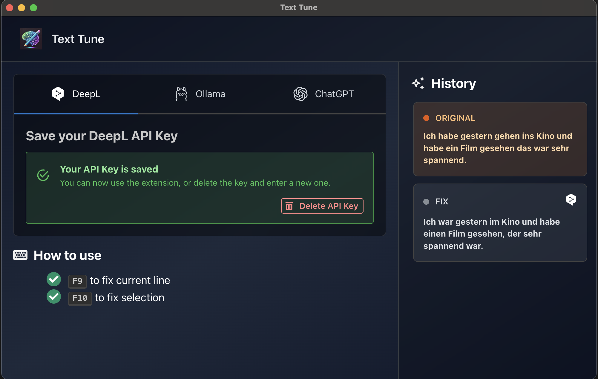

# Text Tune

Text Tune is a desktop assistant that rewrites and fixes text straight from your clipboard. The Electron app offers DeepL, OpenAI and local Ollama models, allowing you to use AI tools to edit your text without leaving your editor, so you can maintain your writing flow.



## Highlights

- Fix German and English text with DeepL, OpenAI, or local Ollama models
- Trigger rewrites from anywhere via global shortcuts (`F9` for the current line, `F10` for the current selection)
- Review the fix history, compare provider output
- Securely store API keys using the operating system’s encrypted storage
- Lightweight tray app that stays out of the way until you need it

## Getting Started

- Install Node.js 22+ (npm 10+ is recommended) and Git
- Clone the repository and install the Electron dependencies:
  ```bash
  git clone https://github.com/Horbee/text-tune.git
  cd text-tune/electron-app
  npm install
  ```
- Launch the desktop app in development mode:
  ```bash
  npm run dev
  ```

## Provider Setup

- The **Services** section inside the app allowes you to choose between DeepL, Ollama, and ChatGPT (OpenAI)
- Paste your DeepL or OpenAI API keys directly in the UI. Keys are encrypted with `safeStorage` and saved under the app’s user data directory
- For Ollama, select the model name that is available on your host; the app will remember your choice across restarts

## Keyboard Workflow & Tray

- `F9` grabs the current line, sends it to the active provider, and pastes the fixed text back
- `F10` fixes the current selection without changing your cursor position
- The tray icon gives quick access to opening the window or quitting the background process

## Building Installers

- Run the platform-specific packaging scripts from `electron-app`:
  ```bash
  npm run build:mac
  npm run build:win
  npm run build:linux
  ```
- For a distribution-ready unpacked build use `npm run build:unpack`

## Repository Layout

- `electron-app/`: Electron + React desktop code (main, preload, and renderer bundles)
- `python/`: command-line version of Text Tune; see the dedicated [README](python/README.md) for usage details

## Troubleshooting

- macOS keyboard automation requires Accessibility access for the app; if permissions get stuck, reset them with:
  ```bash
  tccutil reset Accessibility
  ```
  After resetting you must re-authorize every app that needs Accessibility control.

## License

- [MIT](LICENSE)
